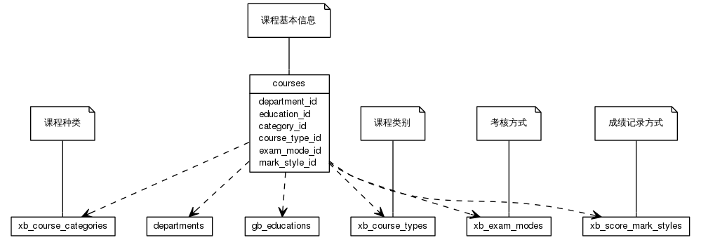


 目  录

* toc
{:toc}

### 关系图 1. 课程
  * 关系图
  

### 表格 course_hours

  * 表格说明

<table class="table table-bordered table-striped table-condensed">
<tr><th style="background-color:#D0D3FF">表名</th><th style="background-color:#D0D3FF">主键</th><th style="background-color:#D0D3FF">注释</th>  </tr>
<tr><td>course_hours</td><td>id</td><td>课程分类课时信息</td>  </tr>
</table>

  * 表格中的列

<table class="table table-bordered table-striped table-condensed">
<tr><th style="background-color:#D0D3FF">序号</th><th style="background-color:#D0D3FF">字段名</th><th style="background-color:#D0D3FF">字段类型</th><th style="background-color:#D0D3FF">是否可空</th><th style="background-color:#D0D3FF">描述</th><th style="background-color:#D0D3FF">引用表</th>  </tr>
<tr><td>1</td><td>id</td><td>int4</td><td>否</td><td>非业务主键:date</td><td></td>  </tr>
<tr><td>2</td><td>period</td><td>int4</td><td>是</td><td>学时/总课时</td><td></td>  </tr>
<tr><td>3</td><td>week_hour</td><td>int4</td><td>是</td><td>周课时</td><td></td>  </tr>
<tr><td>4</td><td>weeks</td><td>int4</td><td>是</td><td>周数</td><td></td>  </tr>
<tr><td>5</td><td>hour_type_id</td><td>int4</td><td>否</td><td>课时类别代码 ID</td><td>xb_course_hour_types</td>  </tr>
<tr><td>6</td><td>course_id</td><td>int8</td><td>否</td><td>课程 ID</td><td>courses</td>  </tr>
</table>

 
  * 表格的索引

<table class="table table-bordered table-striped table-condensed">
  <tr>
<th style="background-color:#D0D3FF">索引名</th><th style="background-color:#D0D3FF">索引字段</th><th style="background-color:#D0D3FF">是否唯一</th>  </tr>
<tr><td>course_hours_pkey</td><td>id&nbsp;</td><td>是</td>  </tr>
</table>

### 表格 courses

  * 表格说明

<table class="table table-bordered table-striped table-condensed">
<tr><th style="background-color:#D0D3FF">表名</th><th style="background-color:#D0D3FF">主键</th><th style="background-color:#D0D3FF">注释</th>  </tr>
<tr><td>courses</td><td>id</td><td>课程基本信息</td>  </tr>
</table>

  * 表格中的列

<table class="table table-bordered table-striped table-condensed">
<tr><th style="background-color:#D0D3FF">序号</th><th style="background-color:#D0D3FF">字段名</th><th style="background-color:#D0D3FF">字段类型</th><th style="background-color:#D0D3FF">是否可空</th><th style="background-color:#D0D3FF">描述</th><th style="background-color:#D0D3FF">引用表</th>  </tr>
<tr><td>1</td><td>id</td><td>int8</td><td>否</td><td>非业务主键:auto_increment</td><td></td>  </tr>
<tr><td>2</td><td>code</td><td>varchar(32)</td><td>否</td><td>课程代码</td><td></td>  </tr>
<tr><td>3</td><td>name</td><td>varchar(222)</td><td>否</td><td>课程名称</td><td></td>  </tr>
<tr><td>4</td><td>en_name</td><td>varchar(300)</td><td>是</td><td>课程英文名</td><td></td>  </tr>
<tr><td>5</td><td>education_id</td><td>int4</td><td>是</td><td>学历层次 ID</td><td>gb_educations</td>  </tr>
<tr><td>6</td><td>category_id</td><td>int4</td><td>是</td><td>课程种类代码 ID</td><td>xb_course_categories</td>  </tr>
<tr><td>7</td><td>credits</td><td>float4</td><td>是</td><td>学分</td><td></td>  </tr>
<tr><td>8</td><td>period</td><td>int4</td><td>是</td><td>学时/总课时</td><td></td>  </tr>
<tr><td>9</td><td>week_hour</td><td>int4</td><td>是</td><td>周课时</td><td></td>  </tr>
<tr><td>10</td><td>weeks</td><td>int4</td><td>是</td><td>周数</td><td></td>  </tr>
<tr><td>11</td><td>department_id</td><td>int4</td><td>是</td><td>院系 ID</td><td>departments</td>  </tr>
<tr><td>12</td><td>establish_on</td><td>date</td><td>是</td><td>设立时间</td><td></td>  </tr>
<tr><td>13</td><td>course_type_id</td><td>int4</td><td>是</td><td>建议课程类别 ID</td><td>xb_course_types</td>  </tr>
<tr><td>14</td><td>exam_mode_id</td><td>int4</td><td>是</td><td>考试方式 ID</td><td>xb_exam_modes</td>  </tr>
<tr><td>15</td><td>mark_style_id</td><td>int4</td><td>是</td><td>成绩记录方式 ID</td><td>xb_score_mark_styles</td>  </tr>
<tr><td>16</td><td>enabled</td><td>bit</td><td>否</td><td>课程使用状态</td><td></td>  </tr>
<tr><td>17</td><td>remark</td><td>varchar(500)</td><td>是</td><td>课程备注</td><td></td>  </tr>
<tr><td>18</td><td>cal_gp</td><td>bit</td><td>否</td><td>是否计算绩点</td><td></td>  </tr>
<tr><td>19</td><td>project_id</td><td>int4</td><td>是</td><td></td><td></td>  </tr>
<tr><td>20</td><td>updated_at</td><td>timestamp</td><td>是</td><td></td><td></td>  </tr>
</table>

 
  * 表格的索引

<table class="table table-bordered table-striped table-condensed">
  <tr>
<th style="background-color:#D0D3FF">索引名</th><th style="background-color:#D0D3FF">索引字段</th><th style="background-color:#D0D3FF">是否唯一</th>  </tr>
<tr><td>courses_pkey</td><td>id&nbsp;</td><td>是</td>  </tr>
<tr><td>uk_61og8rbqdd2y28rx2et5fdnxd</td><td>code&nbsp;</td><td>是</td>  </tr>
</table>

### 表格 courses_majors

  * 表格说明

<table class="table table-bordered table-striped table-condensed">
<tr><th style="background-color:#D0D3FF">表名</th><th style="background-color:#D0D3FF">主键</th><th style="background-color:#D0D3FF">注释</th>  </tr>
<tr><td>courses_majors</td><td>course_id,major_id</td><td>课程基本信息-针对专业</td>  </tr>
</table>

  * 表格中的列

<table class="table table-bordered table-striped table-condensed">
<tr><th style="background-color:#D0D3FF">序号</th><th style="background-color:#D0D3FF">字段名</th><th style="background-color:#D0D3FF">字段类型</th><th style="background-color:#D0D3FF">是否可空</th><th style="background-color:#D0D3FF">描述</th><th style="background-color:#D0D3FF">引用表</th>  </tr>
<tr><td>1</td><td>course_id</td><td>int8</td><td>否</td><td>课程基本信息 ID</td><td>courses</td>  </tr>
<tr><td>2</td><td>major_id</td><td>int4</td><td>否</td><td>专业 ID</td><td>majors</td>  </tr>
</table>

 
  * 表格的索引

<table class="table table-bordered table-striped table-condensed">
  <tr>
<th style="background-color:#D0D3FF">索引名</th><th style="background-color:#D0D3FF">索引字段</th><th style="background-color:#D0D3FF">是否唯一</th>  </tr>
<tr><td>courses_majors_pkey</td><td>course_id&nbsp;major_id&nbsp;</td><td>是</td>  </tr>
</table>

### 表格 courses_prerequisites

  * 表格说明

<table class="table table-bordered table-striped table-condensed">
<tr><th style="background-color:#D0D3FF">表名</th><th style="background-color:#D0D3FF">主键</th><th style="background-color:#D0D3FF">注释</th>  </tr>
<tr><td>courses_prerequisites</td><td>course_id,prerequisite_id</td><td>课程基本信息-先修课程</td>  </tr>
</table>

  * 表格中的列

<table class="table table-bordered table-striped table-condensed">
<tr><th style="background-color:#D0D3FF">序号</th><th style="background-color:#D0D3FF">字段名</th><th style="background-color:#D0D3FF">字段类型</th><th style="background-color:#D0D3FF">是否可空</th><th style="background-color:#D0D3FF">描述</th><th style="background-color:#D0D3FF">引用表</th>  </tr>
<tr><td>1</td><td>course_id</td><td>int8</td><td>否</td><td>课程基本信息 ID</td><td>courses</td>  </tr>
<tr><td>2</td><td>prerequisite_id</td><td>int8</td><td>否</td><td>课程基本信息 ID</td><td>courses</td>  </tr>
</table>

 
  * 表格的索引

<table class="table table-bordered table-striped table-condensed">
  <tr>
<th style="background-color:#D0D3FF">索引名</th><th style="background-color:#D0D3FF">索引字段</th><th style="background-color:#D0D3FF">是否唯一</th>  </tr>
<tr><td>courses_prerequisites_pkey</td><td>course_id&nbsp;prerequisite_id&nbsp;</td><td>是</td>  </tr>
</table>

### 表格 courses_subcourses

  * 表格说明

<table class="table table-bordered table-striped table-condensed">
<tr><th style="background-color:#D0D3FF">表名</th><th style="background-color:#D0D3FF">主键</th><th style="background-color:#D0D3FF">注释</th>  </tr>
<tr><td>courses_subcourses</td><td>course_id,subcourse_id</td><td>课程基本信息-小项课程</td>  </tr>
</table>

  * 表格中的列

<table class="table table-bordered table-striped table-condensed">
<tr><th style="background-color:#D0D3FF">序号</th><th style="background-color:#D0D3FF">字段名</th><th style="background-color:#D0D3FF">字段类型</th><th style="background-color:#D0D3FF">是否可空</th><th style="background-color:#D0D3FF">描述</th><th style="background-color:#D0D3FF">引用表</th>  </tr>
<tr><td>1</td><td>course_id</td><td>int8</td><td>否</td><td>课程基本信息 ID</td><td>courses</td>  </tr>
<tr><td>2</td><td>subcourse_id</td><td>int8</td><td>否</td><td>课程基本信息 ID</td><td>courses</td>  </tr>
</table>

 
  * 表格的索引

<table class="table table-bordered table-striped table-condensed">
  <tr>
<th style="background-color:#D0D3FF">索引名</th><th style="background-color:#D0D3FF">索引字段</th><th style="background-color:#D0D3FF">是否唯一</th>  </tr>
<tr><td>courses_subcourses_pkey</td><td>course_id&nbsp;subcourse_id&nbsp;</td><td>是</td>  </tr>
</table>

### 表格 courses_xmajors

  * 表格说明

<table class="table table-bordered table-striped table-condensed">
<tr><th style="background-color:#D0D3FF">表名</th><th style="background-color:#D0D3FF">主键</th><th style="background-color:#D0D3FF">注释</th>  </tr>
<tr><td>courses_xmajors</td><td>course_id,xmajor_id</td><td>课程基本信息-排除专业</td>  </tr>
</table>

  * 表格中的列

<table class="table table-bordered table-striped table-condensed">
<tr><th style="background-color:#D0D3FF">序号</th><th style="background-color:#D0D3FF">字段名</th><th style="background-color:#D0D3FF">字段类型</th><th style="background-color:#D0D3FF">是否可空</th><th style="background-color:#D0D3FF">描述</th><th style="background-color:#D0D3FF">引用表</th>  </tr>
<tr><td>1</td><td>course_id</td><td>int8</td><td>否</td><td>课程基本信息 ID</td><td>courses</td>  </tr>
<tr><td>2</td><td>xmajor_id</td><td>int4</td><td>否</td><td>专业 ID</td><td>majors</td>  </tr>
</table>

 
  * 表格的索引

<table class="table table-bordered table-striped table-condensed">
  <tr>
<th style="background-color:#D0D3FF">索引名</th><th style="background-color:#D0D3FF">索引字段</th><th style="background-color:#D0D3FF">是否唯一</th>  </tr>
<tr><td>courses_xmajors_pkey</td><td>course_id&nbsp;xmajor_id&nbsp;</td><td>是</td>  </tr>
</table>
