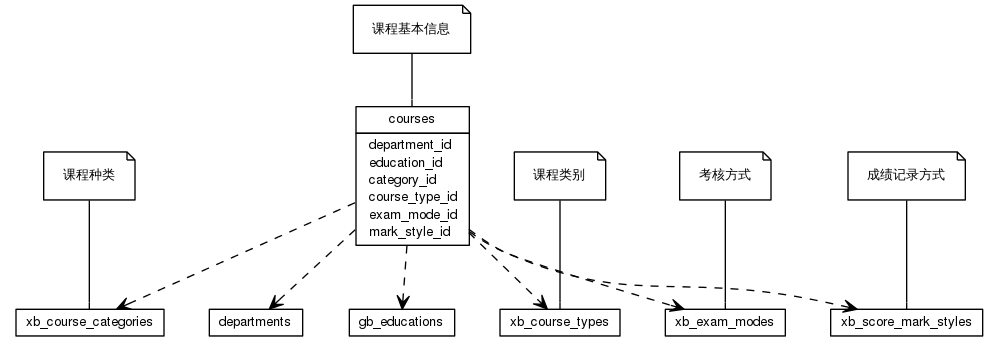
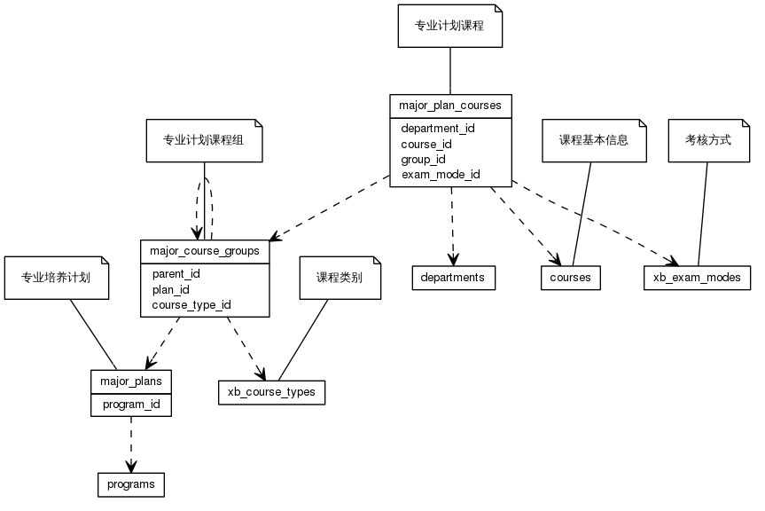
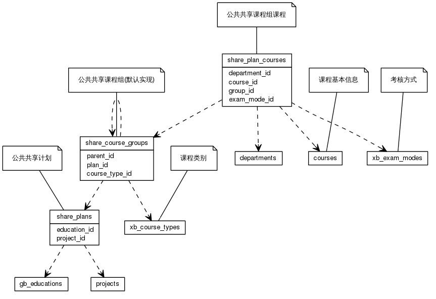
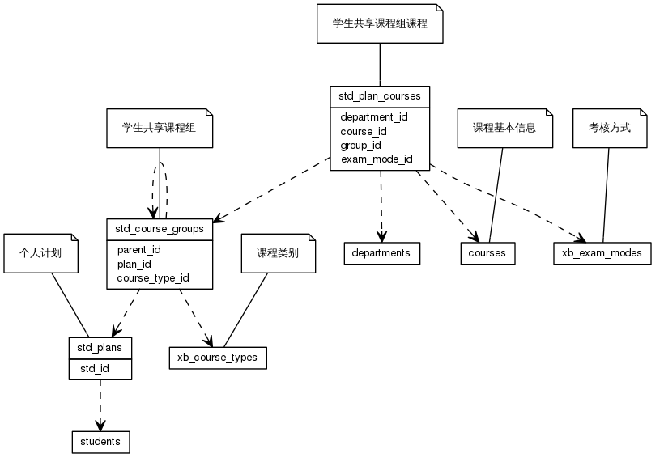
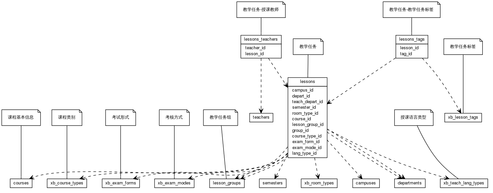
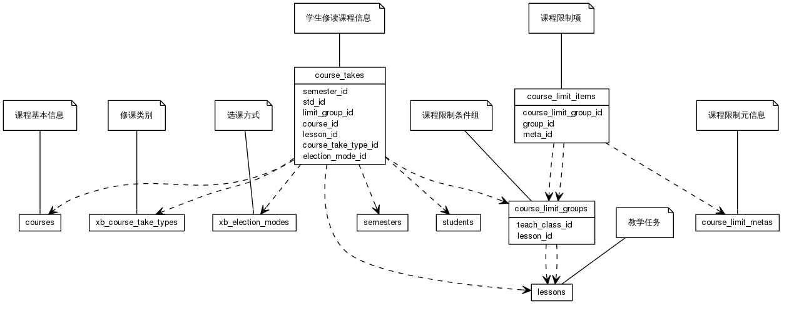
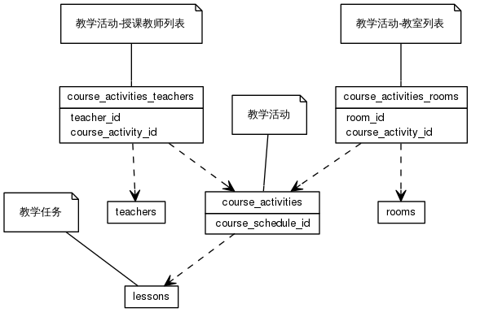
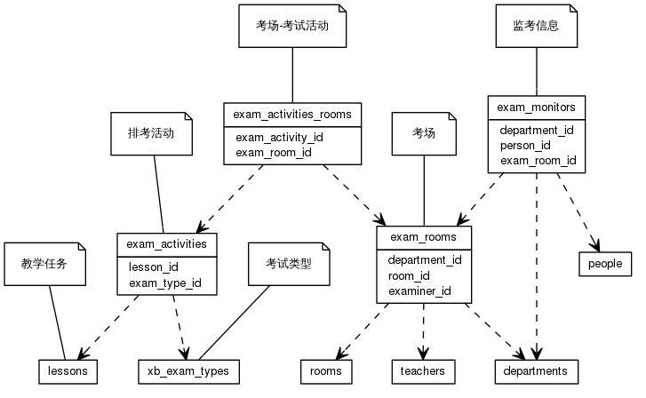
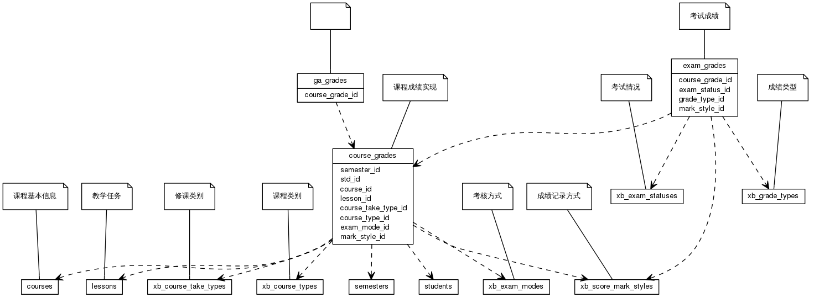
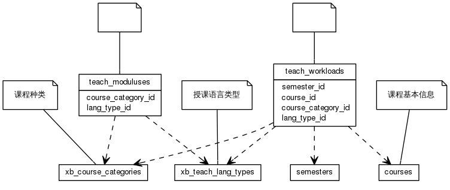


 目  录

* toc
{:toc}

#### 1. 课程
  * 关系图
  

#### 2. 专业培养计划
  * 关系图
  

#### 3. 公共课计划
  * 关系图
  

#### 4. 个人计划
  * 关系图
  

#### 5. 教学任务
  * 关系图
  

#### 6. 学生修读课程
  * 关系图
  

#### 7. 排课
  * 关系图
  

#### 8. 考务安排
  * 关系图
  

#### 9. 学生成绩
  * 关系图
  

#### 10. 教学工作量
  * 关系图
  

