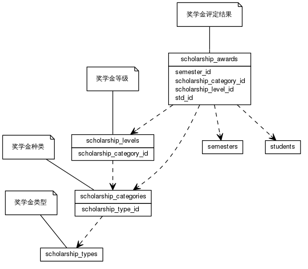


 目  录

* toc
{:toc}

### 关系图 1. 奖学金
  * 关系图
  

### 表格 scholarship_awards

  * 表格说明

<table class="table table-bordered table-striped table-condensed">
<tr><th style="background-color:#D0D3FF">表名</th><th style="background-color:#D0D3FF">主键</th><th style="background-color:#D0D3FF">注释</th>  </tr>
<tr><td>scholarship_awards</td><td>id</td><td>奖学金评定结果</td>  </tr>
</table>

  * 表格中的列

<table class="table table-bordered table-striped table-condensed">
<tr><th style="background-color:#D0D3FF">序号</th><th style="background-color:#D0D3FF">字段名</th><th style="background-color:#D0D3FF">字段类型</th><th style="background-color:#D0D3FF">是否可空</th><th style="background-color:#D0D3FF">描述</th><th style="background-color:#D0D3FF">引用表</th>  </tr>
<tr><td>1</td><td>id</td><td>int8</td><td>否</td><td>非业务主键:date</td><td></td>  </tr>
<tr><td>2</td><td>scholarship_category_id</td><td>int8</td><td>否</td><td>奖学金种类 ID</td><td>scholarship_categories</td>  </tr>
<tr><td>3</td><td>scholarship_level_id</td><td>int8</td><td>否</td><td>获奖等级 ID</td><td>scholarship_levels</td>  </tr>
<tr><td>4</td><td>std_id</td><td>int8</td><td>否</td><td>学生 ID</td><td>students</td>  </tr>
<tr><td>5</td><td>semester_id</td><td>int4</td><td>否</td><td>评定学期 ID</td><td>semesters</td>  </tr>
<tr><td>6</td><td>award_amount</td><td>float4</td><td>是</td><td>金额</td><td></td>  </tr>
<tr><td>7</td><td>be_approved</td><td>bit</td><td>否</td><td>是否审核通过</td><td></td>  </tr>
</table>

 
  * 表格的索引

<table class="table table-bordered table-striped table-condensed">
  <tr>
<th style="background-color:#D0D3FF">索引名</th><th style="background-color:#D0D3FF">索引字段</th><th style="background-color:#D0D3FF">是否唯一</th>  </tr>
<tr><td>scholarship_awards_pkey</td><td>id&nbsp;</td><td>是</td>  </tr>
</table>

### 表格 scholarship_categories

  * 表格说明

<table class="table table-bordered table-striped table-condensed">
<tr><th style="background-color:#D0D3FF">表名</th><th style="background-color:#D0D3FF">主键</th><th style="background-color:#D0D3FF">注释</th>  </tr>
<tr><td>scholarship_categories</td><td>id</td><td>奖学金种类</td>  </tr>
</table>

  * 表格中的列

<table class="table table-bordered table-striped table-condensed">
<tr><th style="background-color:#D0D3FF">序号</th><th style="background-color:#D0D3FF">字段名</th><th style="background-color:#D0D3FF">字段类型</th><th style="background-color:#D0D3FF">是否可空</th><th style="background-color:#D0D3FF">描述</th><th style="background-color:#D0D3FF">引用表</th>  </tr>
<tr><td>1</td><td>id</td><td>int8</td><td>否</td><td>非业务主键:date</td><td></td>  </tr>
<tr><td>2</td><td>code</td><td>varchar(40)</td><td>否</td><td>奖学金代码</td><td></td>  </tr>
<tr><td>3</td><td>name</td><td>varchar(80)</td><td>否</td><td>奖学金名称</td><td></td>  </tr>
<tr><td>4</td><td>enabled</td><td>bit</td><td>否</td><td>使用状态</td><td></td>  </tr>
<tr><td>5</td><td>be_rated</td><td>bit</td><td>否</td><td>是否分等级</td><td></td>  </tr>
<tr><td>6</td><td>discription</td><td>varchar(255)</td><td>是</td><td>奖学金描述</td><td></td>  </tr>
<tr><td>7</td><td>award_unit</td><td>varchar(255)</td><td>是</td><td>颁奖单位</td><td></td>  </tr>
<tr><td>8</td><td>period</td><td>varchar(255)</td><td>是</td><td>评定周期</td><td></td>  </tr>
<tr><td>9</td><td>begin_on</td><td>date</td><td>是</td><td>生效日期</td><td></td>  </tr>
<tr><td>10</td><td>end_on</td><td>date</td><td>是</td><td>失效日期</td><td></td>  </tr>
<tr><td>11</td><td>scholarship_type_id</td><td>int8</td><td>否</td><td>奖学金类型 ID</td><td>scholarship_types</td>  </tr>
</table>

 
  * 表格的索引

<table class="table table-bordered table-striped table-condensed">
  <tr>
<th style="background-color:#D0D3FF">索引名</th><th style="background-color:#D0D3FF">索引字段</th><th style="background-color:#D0D3FF">是否唯一</th>  </tr>
<tr><td>scholarship_categories_pkey</td><td>id&nbsp;</td><td>是</td>  </tr>
<tr><td>uk_31w9ycflyvy67fx46xylmdwx0</td><td>code&nbsp;</td><td>是</td>  </tr>
<tr><td>uk_m3mctcn8pe0bq19ur58kjay40</td><td>name&nbsp;</td><td>是</td>  </tr>
</table>

### 表格 scholarship_levels

  * 表格说明

<table class="table table-bordered table-striped table-condensed">
<tr><th style="background-color:#D0D3FF">表名</th><th style="background-color:#D0D3FF">主键</th><th style="background-color:#D0D3FF">注释</th>  </tr>
<tr><td>scholarship_levels</td><td>id</td><td>奖学金等级</td>  </tr>
</table>

  * 表格中的列

<table class="table table-bordered table-striped table-condensed">
<tr><th style="background-color:#D0D3FF">序号</th><th style="background-color:#D0D3FF">字段名</th><th style="background-color:#D0D3FF">字段类型</th><th style="background-color:#D0D3FF">是否可空</th><th style="background-color:#D0D3FF">描述</th><th style="background-color:#D0D3FF">引用表</th>  </tr>
<tr><td>1</td><td>id</td><td>int8</td><td>否</td><td>非业务主键:date</td><td></td>  </tr>
<tr><td>2</td><td>code</td><td>varchar(40)</td><td>否</td><td>等级代码</td><td></td>  </tr>
<tr><td>3</td><td>name</td><td>varchar(80)</td><td>否</td><td>等级名称</td><td></td>  </tr>
<tr><td>4</td><td>enabled</td><td>bit</td><td>否</td><td>使用状态</td><td></td>  </tr>
<tr><td>5</td><td>discription</td><td>varchar(255)</td><td>是</td><td>等级描述</td><td></td>  </tr>
<tr><td>6</td><td>award_amount</td><td>float4</td><td>是</td><td>奖励金额</td><td></td>  </tr>
<tr><td>7</td><td>scholarship_category_id</td><td>int8</td><td>否</td><td>奖学金种类 ID</td><td>scholarship_categories</td>  </tr>
</table>

 
  * 表格的索引

<table class="table table-bordered table-striped table-condensed">
  <tr>
<th style="background-color:#D0D3FF">索引名</th><th style="background-color:#D0D3FF">索引字段</th><th style="background-color:#D0D3FF">是否唯一</th>  </tr>
<tr><td>scholarship_levels_pkey</td><td>id&nbsp;</td><td>是</td>  </tr>
<tr><td>uk_9l6tunmdn5hcn908w8efxqfgr</td><td>code&nbsp;</td><td>是</td>  </tr>
</table>

### 表格 scholarship_types

  * 表格说明

<table class="table table-bordered table-striped table-condensed">
<tr><th style="background-color:#D0D3FF">表名</th><th style="background-color:#D0D3FF">主键</th><th style="background-color:#D0D3FF">注释</th>  </tr>
<tr><td>scholarship_types</td><td>id</td><td>奖学金类型</td>  </tr>
</table>

  * 表格中的列

<table class="table table-bordered table-striped table-condensed">
<tr><th style="background-color:#D0D3FF">序号</th><th style="background-color:#D0D3FF">字段名</th><th style="background-color:#D0D3FF">字段类型</th><th style="background-color:#D0D3FF">是否可空</th><th style="background-color:#D0D3FF">描述</th><th style="background-color:#D0D3FF">引用表</th>  </tr>
<tr><td>1</td><td>id</td><td>int8</td><td>否</td><td>非业务主键:date</td><td></td>  </tr>
<tr><td>2</td><td>code</td><td>varchar(40)</td><td>否</td><td>类型代码</td><td></td>  </tr>
<tr><td>3</td><td>name</td><td>varchar(80)</td><td>否</td><td>类型名称</td><td></td>  </tr>
<tr><td>4</td><td>enabled</td><td>bit</td><td>否</td><td>使用状态</td><td></td>  </tr>
<tr><td>5</td><td>sequence</td><td>varchar(255)</td><td>是</td><td>排序序号</td><td></td>  </tr>
</table>

 
  * 表格的索引

<table class="table table-bordered table-striped table-condensed">
  <tr>
<th style="background-color:#D0D3FF">索引名</th><th style="background-color:#D0D3FF">索引字段</th><th style="background-color:#D0D3FF">是否唯一</th>  </tr>
<tr><td>scholarship_types_pkey</td><td>id&nbsp;</td><td>是</td>  </tr>
<tr><td>uk_51lkv01t1k78cwmmf1bx7o25i</td><td>name&nbsp;</td><td>是</td>  </tr>
<tr><td>uk_oxfg09n9dct4h0fy8sehjl3i8</td><td>code&nbsp;</td><td>是</td>  </tr>
</table>
