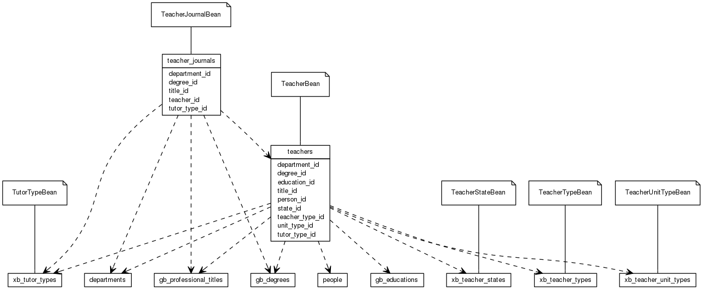


 目  录

* toc
{:toc}

### 关系图 1. 教师
  * 关系图
  

### 表格 teacher_journals

  * 表格说明

<table class="table table-bordered table-striped table-condensed">
<tr><th style="background-color:#D0D3FF">表名</th><th style="background-color:#D0D3FF">主键</th><th style="background-color:#D0D3FF">注释</th>  </tr>
<tr><td>teacher_journals</td><td>id</td><td>TeacherJournalBean</td>  </tr>
</table>

  * 表格中的列

<table class="table table-bordered table-striped table-condensed">
<tr><th style="background-color:#D0D3FF">序号</th><th style="background-color:#D0D3FF">字段名</th><th style="background-color:#D0D3FF">字段类型</th><th style="background-color:#D0D3FF">是否可空</th><th style="background-color:#D0D3FF">描述</th><th style="background-color:#D0D3FF">引用表</th>  </tr>
<tr><td>1</td><td>id</td><td>int4</td><td>否</td><td></td><td></td>  </tr>
<tr><td>2</td><td>teacher_id</td><td>int4</td><td>是</td><td></td><td>teachers</td>  </tr>
<tr><td>3</td><td>department_id</td><td>int4</td><td>是</td><td></td><td>departments</td>  </tr>
<tr><td>4</td><td>title_id</td><td>int4</td><td>是</td><td></td><td>gb_professional_titles</td>  </tr>
<tr><td>5</td><td>degree_id</td><td>int4</td><td>是</td><td></td><td>gb_degrees</td>  </tr>
<tr><td>6</td><td>tutor_type_id</td><td>int4</td><td>是</td><td></td><td>xb_tutor_types</td>  </tr>
<tr><td>7</td><td>begin_on</td><td>date</td><td>是</td><td></td><td></td>  </tr>
<tr><td>8</td><td>end_on</td><td>date</td><td>是</td><td></td><td></td>  </tr>
<tr><td>9</td><td>remark</td><td>varchar(255)</td><td>是</td><td></td><td></td>  </tr>
</table>

 
  * 表格的索引

<table class="table table-bordered table-striped table-condensed">
  <tr>
<th style="background-color:#D0D3FF">索引名</th><th style="background-color:#D0D3FF">索引字段</th><th style="background-color:#D0D3FF">是否唯一</th>  </tr>
<tr><td>teacher_journals_pkey</td><td>id&nbsp;</td><td>是</td>  </tr>
</table>

### 表格 teachers

  * 表格说明

<table class="table table-bordered table-striped table-condensed">
<tr><th style="background-color:#D0D3FF">表名</th><th style="background-color:#D0D3FF">主键</th><th style="background-color:#D0D3FF">注释</th>  </tr>
<tr><td>teachers</td><td>id</td><td>TeacherBean</td>  </tr>
</table>

  * 表格中的列

<table class="table table-bordered table-striped table-condensed">
<tr><th style="background-color:#D0D3FF">序号</th><th style="background-color:#D0D3FF">字段名</th><th style="background-color:#D0D3FF">字段类型</th><th style="background-color:#D0D3FF">是否可空</th><th style="background-color:#D0D3FF">描述</th><th style="background-color:#D0D3FF">引用表</th>  </tr>
<tr><td>1</td><td>id</td><td>int4</td><td>否</td><td></td><td></td>  </tr>
<tr><td>2</td><td>code</td><td>varchar(32)</td><td>否</td><td></td><td></td>  </tr>
<tr><td>3</td><td>person_id</td><td>int8</td><td>否</td><td></td><td>people</td>  </tr>
<tr><td>4</td><td>department_id</td><td>int4</td><td>是</td><td></td><td>departments</td>  </tr>
<tr><td>5</td><td>title_id</td><td>int4</td><td>是</td><td></td><td>gb_professional_titles</td>  </tr>
<tr><td>6</td><td>teacher_type_id</td><td>int4</td><td>是</td><td></td><td>xb_teacher_types</td>  </tr>
<tr><td>7</td><td>education_id</td><td>int4</td><td>是</td><td></td><td>gb_educations</td>  </tr>
<tr><td>8</td><td>graduate_on</td><td>date</td><td>是</td><td></td><td></td>  </tr>
<tr><td>9</td><td>degree_id</td><td>int4</td><td>是</td><td></td><td>gb_degrees</td>  </tr>
<tr><td>10</td><td>degree_award_on</td><td>date</td><td>是</td><td></td><td></td>  </tr>
<tr><td>11</td><td>school</td><td>varchar(255)</td><td>是</td><td></td><td></td>  </tr>
<tr><td>12</td><td>tutor_award_on</td><td>date</td><td>是</td><td></td><td></td>  </tr>
<tr><td>13</td><td>teaching</td><td>bit</td><td>否</td><td></td><td></td>  </tr>
<tr><td>14</td><td>tutor_type_id</td><td>int4</td><td>是</td><td></td><td>xb_tutor_types</td>  </tr>
<tr><td>15</td><td>state_id</td><td>int4</td><td>是</td><td></td><td>xb_teacher_states</td>  </tr>
<tr><td>16</td><td>begin_on</td><td>date</td><td>是</td><td></td><td></td>  </tr>
<tr><td>17</td><td>end_on</td><td>date</td><td>是</td><td></td><td></td>  </tr>
<tr><td>18</td><td>remark</td><td>varchar(500)</td><td>是</td><td></td><td></td>  </tr>
<tr><td>19</td><td>unit</td><td>varchar(255)</td><td>是</td><td></td><td></td>  </tr>
<tr><td>20</td><td>unit_type_id</td><td>int4</td><td>是</td><td></td><td>xb_teacher_unit_types</td>  </tr>
<tr><td>21</td><td>updated_at</td><td>timestamp</td><td>是</td><td></td><td></td>  </tr>
</table>

 
  * 表格的索引

<table class="table table-bordered table-striped table-condensed">
  <tr>
<th style="background-color:#D0D3FF">索引名</th><th style="background-color:#D0D3FF">索引字段</th><th style="background-color:#D0D3FF">是否唯一</th>  </tr>
<tr><td>teachers_pkey</td><td>id&nbsp;</td><td>是</td>  </tr>
<tr><td>uk_lmg2qx967u1knxjscfxomathn</td><td>code&nbsp;</td><td>是</td>  </tr>
</table>
