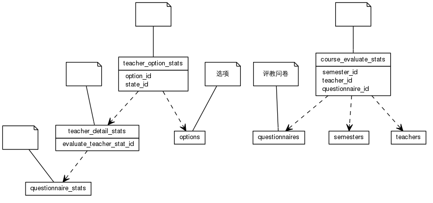


 目  录

* toc
{:toc}

### 关系图 1. 教师排名
  * 关系图
  

### 表格 course_evaluate_stats

  * 表格说明

<table class="table table-bordered table-striped table-condensed">
<tr><th style="background-color:#D0D3FF">表名</th><th style="background-color:#D0D3FF">主键</th><th style="background-color:#D0D3FF">注释</th>  </tr>
<tr><td>course_evaluate_stats</td><td>id</td><td></td>  </tr>
</table>

  * 表格中的列

<table class="table table-bordered table-striped table-condensed">
<tr><th style="background-color:#D0D3FF">序号</th><th style="background-color:#D0D3FF">字段名</th><th style="background-color:#D0D3FF">字段类型</th><th style="background-color:#D0D3FF">是否可空</th><th style="background-color:#D0D3FF">描述</th><th style="background-color:#D0D3FF">引用表</th>  </tr>
<tr><td>1</td><td>id</td><td>int8</td><td>否</td><td></td><td></td>  </tr>
<tr><td>2</td><td>std_evaluate</td><td>float4</td><td>是</td><td></td><td></td>  </tr>
<tr><td>3</td><td>dep_evaluate</td><td>float4</td><td>是</td><td></td><td></td>  </tr>
<tr><td>4</td><td>score</td><td>float4</td><td>是</td><td></td><td></td>  </tr>
<tr><td>5</td><td>rank</td><td>int4</td><td>是</td><td></td><td></td>  </tr>
<tr><td>6</td><td>depart_rank</td><td>int4</td><td>是</td><td></td><td></td>  </tr>
<tr><td>7</td><td>teacher_id</td><td>int4</td><td>否</td><td></td><td>teachers</td>  </tr>
<tr><td>8</td><td>semester_id</td><td>int4</td><td>否</td><td></td><td>semesters</td>  </tr>
<tr><td>9</td><td>questionnaire_id</td><td>int8</td><td>否</td><td></td><td>questionnaires</td>  </tr>
</table>

 
  * 表格的索引

<table class="table table-bordered table-striped table-condensed">
  <tr>
<th style="background-color:#D0D3FF">索引名</th><th style="background-color:#D0D3FF">索引字段</th><th style="background-color:#D0D3FF">是否唯一</th>  </tr>
<tr><td>course_evaluate_stats_pkey</td><td>id&nbsp;</td><td>是</td>  </tr>
</table>

### 表格 teacher_detail_stats

  * 表格说明

<table class="table table-bordered table-striped table-condensed">
<tr><th style="background-color:#D0D3FF">表名</th><th style="background-color:#D0D3FF">主键</th><th style="background-color:#D0D3FF">注释</th>  </tr>
<tr><td>teacher_detail_stats</td><td>id</td><td></td>  </tr>
</table>

  * 表格中的列

<table class="table table-bordered table-striped table-condensed">
<tr><th style="background-color:#D0D3FF">序号</th><th style="background-color:#D0D3FF">字段名</th><th style="background-color:#D0D3FF">字段类型</th><th style="background-color:#D0D3FF">是否可空</th><th style="background-color:#D0D3FF">描述</th><th style="background-color:#D0D3FF">引用表</th>  </tr>
<tr><td>1</td><td>id</td><td>int8</td><td>否</td><td></td><td></td>  </tr>
<tr><td>2</td><td>evaluate_teacher_stat_id</td><td>int8</td><td>否</td><td></td><td>questionnaire_stats</td>  </tr>
</table>

 
  * 表格的索引

<table class="table table-bordered table-striped table-condensed">
  <tr>
<th style="background-color:#D0D3FF">索引名</th><th style="background-color:#D0D3FF">索引字段</th><th style="background-color:#D0D3FF">是否唯一</th>  </tr>
<tr><td>teacher_detail_stats_pkey</td><td>id&nbsp;</td><td>是</td>  </tr>
</table>

### 表格 teacher_option_stats

  * 表格说明

<table class="table table-bordered table-striped table-condensed">
<tr><th style="background-color:#D0D3FF">表名</th><th style="background-color:#D0D3FF">主键</th><th style="background-color:#D0D3FF">注释</th>  </tr>
<tr><td>teacher_option_stats</td><td>id</td><td></td>  </tr>
</table>

  * 表格中的列

<table class="table table-bordered table-striped table-condensed">
<tr><th style="background-color:#D0D3FF">序号</th><th style="background-color:#D0D3FF">字段名</th><th style="background-color:#D0D3FF">字段类型</th><th style="background-color:#D0D3FF">是否可空</th><th style="background-color:#D0D3FF">描述</th><th style="background-color:#D0D3FF">引用表</th>  </tr>
<tr><td>1</td><td>id</td><td>int8</td><td>否</td><td></td><td></td>  </tr>
<tr><td>2</td><td>amount</td><td>int4</td><td>是</td><td></td><td></td>  </tr>
<tr><td>3</td><td>option_id</td><td>int8</td><td>是</td><td></td><td>options</td>  </tr>
<tr><td>4</td><td>state_id</td><td>int8</td><td>是</td><td></td><td>teacher_detail_stats</td>  </tr>
</table>

 
  * 表格的索引

<table class="table table-bordered table-striped table-condensed">
  <tr>
<th style="background-color:#D0D3FF">索引名</th><th style="background-color:#D0D3FF">索引字段</th><th style="background-color:#D0D3FF">是否唯一</th>  </tr>
<tr><td>teacher_option_stats_pkey</td><td>id&nbsp;</td><td>是</td>  </tr>
</table>
