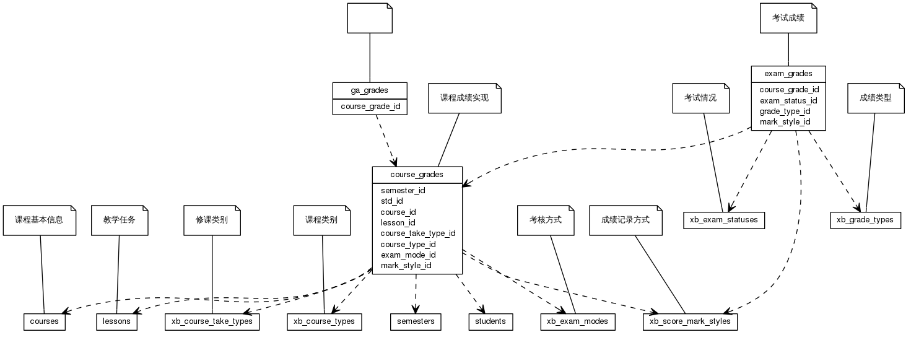


 目  录

* toc
{:toc}

### 关系图 1. 学生成绩
  * 关系图
  

### 表格 course_grades

  * 表格说明

<table class="table table-bordered table-striped table-condensed">
<tr><th style="background-color:#D0D3FF">表名</th><th style="background-color:#D0D3FF">主键</th><th style="background-color:#D0D3FF">注释</th>  </tr>
<tr><td>course_grades</td><td>id</td><td>课程成绩实现</td>  </tr>
</table>

  * 表格中的列

<table class="table table-bordered table-striped table-condensed">
<tr><th style="background-color:#D0D3FF">序号</th><th style="background-color:#D0D3FF">字段名</th><th style="background-color:#D0D3FF">字段类型</th><th style="background-color:#D0D3FF">是否可空</th><th style="background-color:#D0D3FF">描述</th><th style="background-color:#D0D3FF">引用表</th>  </tr>
<tr><td>1</td><td>id</td><td>int8</td><td>否</td><td>非业务主键:date</td><td></td>  </tr>
<tr><td>2</td><td>course_id</td><td>int8</td><td>否</td><td>课程 ID</td><td>courses</td>  </tr>
<tr><td>3</td><td>lesson_no</td><td>varchar(20)</td><td>是</td><td>课程序号</td><td></td>  </tr>
<tr><td>4</td><td>course_take_type_id</td><td>int4</td><td>是</td><td>修读类别 ID</td><td>xb_course_take_types</td>  </tr>
<tr><td>5</td><td>course_type_id</td><td>int4</td><td>是</td><td>课程类别 ID</td><td>xb_course_types</td>  </tr>
<tr><td>6</td><td>gp</td><td>float4</td><td>是</td><td>绩点</td><td></td>  </tr>
<tr><td>7</td><td>exam_mode_id</td><td>int4</td><td>是</td><td>考核方式 ID</td><td>xb_exam_modes</td>  </tr>
<tr><td>8</td><td>remark</td><td>varchar(200)</td><td>是</td><td>备注</td><td></td>  </tr>
<tr><td>9</td><td>operator</td><td>varchar(100)</td><td>是</td><td>操作者</td><td></td>  </tr>
<tr><td>10</td><td>passed</td><td>bit</td><td>否</td><td>是否通过</td><td></td>  </tr>
<tr><td>11</td><td>score</td><td>float4</td><td>是</td><td>得分</td><td></td>  </tr>
<tr><td>12</td><td>score_text</td><td>varchar(5)</td><td>是</td><td>得分字面值</td><td></td>  </tr>
<tr><td>13</td><td>semester_id</td><td>int4</td><td>否</td><td>学期 ID</td><td>semesters</td>  </tr>
<tr><td>14</td><td>status</td><td>int4</td><td>否</td><td>成绩状态</td><td></td>  </tr>
<tr><td>15</td><td>std_id</td><td>int8</td><td>否</td><td>学生 ID</td><td>students</td>  </tr>
<tr><td>16</td><td>mark_style_id</td><td>int4</td><td>否</td><td>成绩记录方式 ID</td><td>xb_score_mark_styles</td>  </tr>
<tr><td>17</td><td>lesson_id</td><td>int4</td><td>是</td><td></td><td>lessons</td>  </tr>
</table>

 
  * 表格的索引

<table class="table table-bordered table-striped table-condensed">
  <tr>
<th style="background-color:#D0D3FF">索引名</th><th style="background-color:#D0D3FF">索引字段</th><th style="background-color:#D0D3FF">是否唯一</th>  </tr>
<tr><td>course_grades_pkey</td><td>id&nbsp;</td><td>是</td>  </tr>
</table>

### 表格 exam_grades

  * 表格说明

<table class="table table-bordered table-striped table-condensed">
<tr><th style="background-color:#D0D3FF">表名</th><th style="background-color:#D0D3FF">主键</th><th style="background-color:#D0D3FF">注释</th>  </tr>
<tr><td>exam_grades</td><td>id</td><td>考试成绩</td>  </tr>
</table>

  * 表格中的列

<table class="table table-bordered table-striped table-condensed">
<tr><th style="background-color:#D0D3FF">序号</th><th style="background-color:#D0D3FF">字段名</th><th style="background-color:#D0D3FF">字段类型</th><th style="background-color:#D0D3FF">是否可空</th><th style="background-color:#D0D3FF">描述</th><th style="background-color:#D0D3FF">引用表</th>  </tr>
<tr><td>1</td><td>id</td><td>int8</td><td>否</td><td>非业务主键:date</td><td></td>  </tr>
<tr><td>2</td><td>grade_type_id</td><td>int4</td><td>否</td><td>成绩类型 ID</td><td>xb_grade_types</td>  </tr>
<tr><td>3</td><td>mark_style_id</td><td>int4</td><td>否</td><td>成绩记录方式 ID</td><td>xb_score_mark_styles</td>  </tr>
<tr><td>4</td><td>exam_status_id</td><td>int4</td><td>否</td><td>考试情况 ID</td><td>xb_exam_statuses</td>  </tr>
<tr><td>5</td><td>score</td><td>float4</td><td>是</td><td>得分</td><td></td>  </tr>
<tr><td>6</td><td>score_text</td><td>varchar(5)</td><td>是</td><td>得分字面值</td><td></td>  </tr>
<tr><td>7</td><td>course_grade_id</td><td>int8</td><td>否</td><td>对应的课程成绩 ID</td><td>course_grades</td>  </tr>
<tr><td>8</td><td>status</td><td>int4</td><td>是</td><td>成绩状态</td><td></td>  </tr>
<tr><td>9</td><td>passed</td><td>bit</td><td>是</td><td>是否通过</td><td></td>  </tr>
<tr><td>10</td><td>operator</td><td>varchar(100)</td><td>是</td><td>操作者</td><td></td>  </tr>
<tr><td>11</td><td>percent</td><td>int4</td><td>是</td><td>百分比描述</td><td></td>  </tr>
</table>

 
  * 表格的索引

<table class="table table-bordered table-striped table-condensed">
  <tr>
<th style="background-color:#D0D3FF">索引名</th><th style="background-color:#D0D3FF">索引字段</th><th style="background-color:#D0D3FF">是否唯一</th>  </tr>
<tr><td>exam_grades_pkey</td><td>id&nbsp;</td><td>是</td>  </tr>
</table>

### 表格 ga_grades

  * 表格说明

<table class="table table-bordered table-striped table-condensed">
<tr><th style="background-color:#D0D3FF">表名</th><th style="background-color:#D0D3FF">主键</th><th style="background-color:#D0D3FF">注释</th>  </tr>
<tr><td>ga_grades</td><td>id</td><td></td>  </tr>
</table>

  * 表格中的列

<table class="table table-bordered table-striped table-condensed">
<tr><th style="background-color:#D0D3FF">序号</th><th style="background-color:#D0D3FF">字段名</th><th style="background-color:#D0D3FF">字段类型</th><th style="background-color:#D0D3FF">是否可空</th><th style="background-color:#D0D3FF">描述</th><th style="background-color:#D0D3FF">引用表</th>  </tr>
<tr><td>1</td><td>id</td><td>int8</td><td>否</td><td></td><td></td>  </tr>
<tr><td>2</td><td>grade_type_id</td><td>int4</td><td>否</td><td></td><td></td>  </tr>
<tr><td>3</td><td>mark_style_id</td><td>int4</td><td>否</td><td></td><td></td>  </tr>
<tr><td>4</td><td>score</td><td>float4</td><td>是</td><td></td><td></td>  </tr>
<tr><td>5</td><td>score_text</td><td>varchar(5)</td><td>是</td><td></td><td></td>  </tr>
<tr><td>6</td><td>course_grade_id</td><td>int8</td><td>否</td><td></td><td>course_grades</td>  </tr>
<tr><td>7</td><td>status</td><td>int4</td><td>否</td><td></td><td></td>  </tr>
<tr><td>8</td><td>passed</td><td>bit</td><td>否</td><td></td><td></td>  </tr>
<tr><td>9</td><td>operator</td><td>varchar(100)</td><td>是</td><td></td><td></td>  </tr>
<tr><td>10</td><td>gp</td><td>float4</td><td>是</td><td></td><td></td>  </tr>
<tr><td>11</td><td>ratio</td><td>int2</td><td>否</td><td></td><td></td>  </tr>
</table>

 
  * 表格的索引

<table class="table table-bordered table-striped table-condensed">
  <tr>
<th style="background-color:#D0D3FF">索引名</th><th style="background-color:#D0D3FF">索引字段</th><th style="background-color:#D0D3FF">是否唯一</th>  </tr>
<tr><td>ga_grades_pkey</td><td>id&nbsp;</td><td>是</td>  </tr>
</table>
