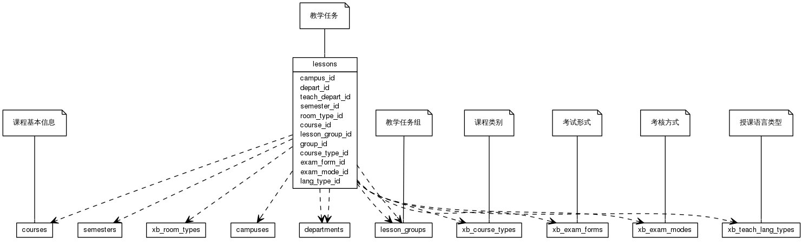


 目  录

* toc
{:toc}

### 关系图 1. 教学任务
  * 关系图
  

### 表格 course_limit_groups

  * 表格说明

<table class="table table-bordered table-striped table-condensed">
<tr><th style="background-color:#D0D3FF">表名</th><th style="background-color:#D0D3FF">主键</th><th style="background-color:#D0D3FF">注释</th>  </tr>
<tr><td>course_limit_groups</td><td>id</td><td>课程限制条件组</td>  </tr>
</table>

  * 表格中的列

<table class="table table-bordered table-striped table-condensed">
<tr><th style="background-color:#D0D3FF">序号</th><th style="background-color:#D0D3FF">字段名</th><th style="background-color:#D0D3FF">字段类型</th><th style="background-color:#D0D3FF">是否可空</th><th style="background-color:#D0D3FF">描述</th><th style="background-color:#D0D3FF">引用表</th>  </tr>
<tr><td>1</td><td>id</td><td>int4</td><td>否</td><td>非业务主键:date</td><td></td>  </tr>
<tr><td>2</td><td>lesson_id</td><td>int4</td><td>否</td><td>教学任务 ID</td><td>lessons</td>  </tr>
<tr><td>3</td><td>max_count</td><td>int4</td><td>否</td><td>最大人数</td><td></td>  </tr>
<tr><td>4</td><td>cur_count</td><td>int4</td><td>否</td><td>当前人数</td><td></td>  </tr>
<tr><td>5</td><td>for_class</td><td>bit</td><td>否</td><td>授课对象还是选课对象</td><td></td>  </tr>
<tr><td>6</td><td>teach_class_id</td><td>int4</td><td>是</td><td></td><td>lessons</td>  </tr>
</table>

 
  * 表格的索引

<table class="table table-bordered table-striped table-condensed">
  <tr>
<th style="background-color:#D0D3FF">索引名</th><th style="background-color:#D0D3FF">索引字段</th><th style="background-color:#D0D3FF">是否唯一</th>  </tr>
<tr><td>course_limit_groups_pkey</td><td>id&nbsp;</td><td>是</td>  </tr>
</table>

### 表格 course_limit_items

  * 表格说明

<table class="table table-bordered table-striped table-condensed">
<tr><th style="background-color:#D0D3FF">表名</th><th style="background-color:#D0D3FF">主键</th><th style="background-color:#D0D3FF">注释</th>  </tr>
<tr><td>course_limit_items</td><td>id</td><td>课程限制项</td>  </tr>
</table>

  * 表格中的列

<table class="table table-bordered table-striped table-condensed">
<tr><th style="background-color:#D0D3FF">序号</th><th style="background-color:#D0D3FF">字段名</th><th style="background-color:#D0D3FF">字段类型</th><th style="background-color:#D0D3FF">是否可空</th><th style="background-color:#D0D3FF">描述</th><th style="background-color:#D0D3FF">引用表</th>  </tr>
<tr><td>1</td><td>id</td><td>int4</td><td>否</td><td>非业务主键:date</td><td></td>  </tr>
<tr><td>2</td><td>meta_id</td><td>int4</td><td>否</td><td>限制具体项目 ID</td><td>course_limit_metas</td>  </tr>
<tr><td>3</td><td>group_id</td><td>int4</td><td>否</td><td>所在限制组 ID</td><td>course_limit_groups</td>  </tr>
<tr><td>4</td><td>operator</td><td>varchar(255)</td><td>否</td><td>操作符</td><td></td>  </tr>
<tr><td>5</td><td>content</td><td>varchar(255)</td><td>否</td><td>限制内容</td><td></td>  </tr>
<tr><td>6</td><td>course_limit_group_id</td><td>int4</td><td>是</td><td></td><td>course_limit_groups</td>  </tr>
</table>

 
  * 表格的索引

<table class="table table-bordered table-striped table-condensed">
  <tr>
<th style="background-color:#D0D3FF">索引名</th><th style="background-color:#D0D3FF">索引字段</th><th style="background-color:#D0D3FF">是否唯一</th>  </tr>
<tr><td>course_limit_items_pkey</td><td>id&nbsp;</td><td>是</td>  </tr>
</table>

### 表格 course_limit_metas

  * 表格说明

<table class="table table-bordered table-striped table-condensed">
<tr><th style="background-color:#D0D3FF">表名</th><th style="background-color:#D0D3FF">主键</th><th style="background-color:#D0D3FF">注释</th>  </tr>
<tr><td>course_limit_metas</td><td>id</td><td>课程限制元信息</td>  </tr>
</table>

  * 表格中的列

<table class="table table-bordered table-striped table-condensed">
<tr><th style="background-color:#D0D3FF">序号</th><th style="background-color:#D0D3FF">字段名</th><th style="background-color:#D0D3FF">字段类型</th><th style="background-color:#D0D3FF">是否可空</th><th style="background-color:#D0D3FF">描述</th><th style="background-color:#D0D3FF">引用表</th>  </tr>
<tr><td>1</td><td>id</td><td>int4</td><td>否</td><td>非业务主键:auto_increment</td><td></td>  </tr>
<tr><td>2</td><td>name</td><td>varchar(255)</td><td>否</td><td>名称</td><td></td>  </tr>
<tr><td>3</td><td>remark</td><td>varchar(255)</td><td>否</td><td>备注</td><td></td>  </tr>
</table>

 
  * 表格的索引

<table class="table table-bordered table-striped table-condensed">
  <tr>
<th style="background-color:#D0D3FF">索引名</th><th style="background-color:#D0D3FF">索引字段</th><th style="background-color:#D0D3FF">是否唯一</th>  </tr>
<tr><td>course_limit_metas_pkey</td><td>id&nbsp;</td><td>是</td>  </tr>
</table>

### 表格 course_takes

  * 表格说明

<table class="table table-bordered table-striped table-condensed">
<tr><th style="background-color:#D0D3FF">表名</th><th style="background-color:#D0D3FF">主键</th><th style="background-color:#D0D3FF">注释</th>  </tr>
<tr><td>course_takes</td><td>id</td><td>学生修读课程信息</td>  </tr>
</table>

  * 表格中的列

<table class="table table-bordered table-striped table-condensed">
<tr><th style="background-color:#D0D3FF">序号</th><th style="background-color:#D0D3FF">字段名</th><th style="background-color:#D0D3FF">字段类型</th><th style="background-color:#D0D3FF">是否可空</th><th style="background-color:#D0D3FF">描述</th><th style="background-color:#D0D3FF">引用表</th>  </tr>
<tr><td>1</td><td>id</td><td>int8</td><td>否</td><td>非业务主键:date</td><td></td>  </tr>
<tr><td>2</td><td>lesson_id</td><td>int4</td><td>否</td><td>教学任务 ID</td><td>lessons</td>  </tr>
<tr><td>3</td><td>course_id</td><td>int8</td><td>否</td><td>课程基本信息 ID</td><td>courses</td>  </tr>
<tr><td>4</td><td>semester_id</td><td>int4</td><td>否</td><td>学年学期 ID</td><td>semesters</td>  </tr>
<tr><td>5</td><td>std_id</td><td>int8</td><td>否</td><td>学生 ID</td><td>students</td>  </tr>
<tr><td>6</td><td>course_take_type_id</td><td>int4</td><td>否</td><td>修读类别 ID</td><td>xb_course_take_types</td>  </tr>
<tr><td>7</td><td>election_mode_id</td><td>int8</td><td>否</td><td>选课方式 ID</td><td>xb_election_modes</td>  </tr>
<tr><td>8</td><td>turn</td><td>int4</td><td>是</td><td>选课轮次</td><td></td>  </tr>
<tr><td>9</td><td>remark</td><td>varchar(100)</td><td>是</td><td>备注</td><td></td>  </tr>
<tr><td>10</td><td>limit_group_id</td><td>int4</td><td>是</td><td>授课对象组 ID</td><td>course_limit_groups</td>  </tr>
<tr><td>11</td><td>preselection</td><td>bit</td><td>是</td><td></td><td></td>  </tr>
</table>

 
  * 表格的索引

<table class="table table-bordered table-striped table-condensed">
  <tr>
<th style="background-color:#D0D3FF">索引名</th><th style="background-color:#D0D3FF">索引字段</th><th style="background-color:#D0D3FF">是否唯一</th>  </tr>
<tr><td>course_takes_pkey</td><td>id&nbsp;</td><td>是</td>  </tr>
</table>

### 表格 lessons

  * 表格说明

<table class="table table-bordered table-striped table-condensed">
<tr><th style="background-color:#D0D3FF">表名</th><th style="background-color:#D0D3FF">主键</th><th style="background-color:#D0D3FF">注释</th>  </tr>
<tr><td>lessons</td><td>id</td><td>教学任务</td>  </tr>
</table>

  * 表格中的列

<table class="table table-bordered table-striped table-condensed">
<tr><th style="background-color:#D0D3FF">序号</th><th style="background-color:#D0D3FF">字段名</th><th style="background-color:#D0D3FF">字段类型</th><th style="background-color:#D0D3FF">是否可空</th><th style="background-color:#D0D3FF">描述</th><th style="background-color:#D0D3FF">引用表</th>  </tr>
<tr><td>1</td><td>id</td><td>int4</td><td>否</td><td>非业务主键:date</td><td></td>  </tr>
<tr><td>2</td><td>no</td><td>varchar(32)</td><td>否</td><td>课程序号</td><td></td>  </tr>
<tr><td>3</td><td>course_id</td><td>int8</td><td>否</td><td>课程 ID</td><td>courses</td>  </tr>
<tr><td>4</td><td>course_type_id</td><td>int4</td><td>否</td><td>课程类别 ID</td><td>xb_course_types</td>  </tr>
<tr><td>5</td><td>teach_depart_id</td><td>int4</td><td>否</td><td>开课院系 ID</td><td>departments</td>  </tr>
<tr><td>6</td><td>campus_id</td><td>int4</td><td>是</td><td>开课校区 ID</td><td>campuses</td>  </tr>
<tr><td>7</td><td>semester_id</td><td>int4</td><td>否</td><td>教学日历 ID</td><td>semesters</td>  </tr>
<tr><td>8</td><td>name</td><td>varchar(4000)</td><td>否</td><td>名称</td><td></td>  </tr>
<tr><td>9</td><td>fullname</td><td>varchar(4000)</td><td>否</td><td>fullname</td><td></td>  </tr>
<tr><td>10</td><td>grade</td><td>varchar(255)</td><td>是</td><td>grade</td><td></td>  </tr>
<tr><td>11</td><td>depart_id</td><td>int4</td><td>是</td><td>depart ID</td><td>departments</td>  </tr>
<tr><td>12</td><td>std_count</td><td>int4</td><td>否</td><td>stdCount</td><td></td>  </tr>
<tr><td>13</td><td>limit_count</td><td>int4</td><td>是</td><td>limitCount</td><td></td>  </tr>
<tr><td>14</td><td>limit_locked</td><td>bit</td><td>否</td><td>limitLocked</td><td></td>  </tr>
<tr><td>15</td><td>reserved_count</td><td>int4</td><td>是</td><td>reservedCount</td><td></td>  </tr>
<tr><td>16</td><td>start_week</td><td>int4</td><td>否</td><td>startWeek</td><td></td>  </tr>
<tr><td>17</td><td>end_week</td><td>int4</td><td>否</td><td>endWeek</td><td></td>  </tr>
<tr><td>18</td><td>period</td><td>int4</td><td>否</td><td>period</td><td></td>  </tr>
<tr><td>19</td><td>course_period</td><td>int4</td><td>是</td><td>coursePeriod</td><td></td>  </tr>
<tr><td>20</td><td>week_state</td><td>int8</td><td>是</td><td>weekState</td><td></td>  </tr>
<tr><td>21</td><td>room_type_id</td><td>int4</td><td>是</td><td>roomType ID</td><td>xb_room_types</td>  </tr>
<tr><td>22</td><td>published</td><td>bit</td><td>否</td><td>published</td><td></td>  </tr>
<tr><td>23</td><td>remark</td><td>varchar(500)</td><td>是</td><td>备注</td><td></td>  </tr>
<tr><td>24</td><td>lang_type_id</td><td>int8</td><td>是</td><td>授课语言类型 ID</td><td>xb_teach_lang_types</td>  </tr>
<tr><td>25</td><td>group_id</td><td>int8</td><td>是</td><td>所属课程组 ID</td><td>lesson_groups</td>  </tr>
<tr><td>26</td><td>exam_form_id</td><td>int8</td><td>是</td><td>examForm ID</td><td>xb_exam_forms</td>  </tr>
<tr><td>27</td><td>exam_mode_id</td><td>int4</td><td>是</td><td>examMode ID</td><td>xb_exam_modes</td>  </tr>
<tr><td>28</td><td>lesson_group_id</td><td>int8</td><td>是</td><td></td><td>lesson_groups</td>  </tr>
<tr><td>29</td><td>old_id</td><td>int4</td><td>是</td><td></td><td></td>  </tr>
<tr><td>30</td><td>project_id</td><td>int4</td><td>否</td><td></td><td></td>  </tr>
</table>

 
  * 表格的索引

<table class="table table-bordered table-striped table-condensed">
  <tr>
<th style="background-color:#D0D3FF">索引名</th><th style="background-color:#D0D3FF">索引字段</th><th style="background-color:#D0D3FF">是否唯一</th>  </tr>
<tr><td>lessons_pkey</td><td>id&nbsp;</td><td>是</td>  </tr>
</table>

### 表格 lessons_tags

  * 表格说明

<table class="table table-bordered table-striped table-condensed">
<tr><th style="background-color:#D0D3FF">表名</th><th style="background-color:#D0D3FF">主键</th><th style="background-color:#D0D3FF">注释</th>  </tr>
<tr><td>lessons_tags</td><td>lesson_id,tag_id</td><td>教学任务-教学任务标签</td>  </tr>
</table>

  * 表格中的列

<table class="table table-bordered table-striped table-condensed">
<tr><th style="background-color:#D0D3FF">序号</th><th style="background-color:#D0D3FF">字段名</th><th style="background-color:#D0D3FF">字段类型</th><th style="background-color:#D0D3FF">是否可空</th><th style="background-color:#D0D3FF">描述</th><th style="background-color:#D0D3FF">引用表</th>  </tr>
<tr><td>1</td><td>lesson_id</td><td>int4</td><td>否</td><td>教学任务 ID</td><td>lessons</td>  </tr>
<tr><td>2</td><td>tag_id</td><td>int4</td><td>否</td><td>教学任务标签 ID</td><td>xb_lesson_tags</td>  </tr>
</table>

 
  * 表格的索引

<table class="table table-bordered table-striped table-condensed">
  <tr>
<th style="background-color:#D0D3FF">索引名</th><th style="background-color:#D0D3FF">索引字段</th><th style="background-color:#D0D3FF">是否唯一</th>  </tr>
<tr><td>lessons_tags_pkey</td><td>lesson_id&nbsp;tag_id&nbsp;</td><td>是</td>  </tr>
</table>

### 表格 lessons_teachers

  * 表格说明

<table class="table table-bordered table-striped table-condensed">
<tr><th style="background-color:#D0D3FF">表名</th><th style="background-color:#D0D3FF">主键</th><th style="background-color:#D0D3FF">注释</th>  </tr>
<tr><td>lessons_teachers</td><td>lesson_id,teacher_id</td><td>教学任务-授课教师</td>  </tr>
</table>

  * 表格中的列

<table class="table table-bordered table-striped table-condensed">
<tr><th style="background-color:#D0D3FF">序号</th><th style="background-color:#D0D3FF">字段名</th><th style="background-color:#D0D3FF">字段类型</th><th style="background-color:#D0D3FF">是否可空</th><th style="background-color:#D0D3FF">描述</th><th style="background-color:#D0D3FF">引用表</th>  </tr>
<tr><td>1</td><td>lesson_id</td><td>int4</td><td>否</td><td>教学任务 ID</td><td>lessons</td>  </tr>
<tr><td>2</td><td>teacher_id</td><td>int4</td><td>否</td><td>TeacherBean ID</td><td>teachers</td>  </tr>
<tr><td>3</td><td>idx</td><td>int4</td><td>是</td><td></td><td></td>  </tr>
</table>

 
  * 表格的索引

<table class="table table-bordered table-striped table-condensed">
  <tr>
<th style="background-color:#D0D3FF">索引名</th><th style="background-color:#D0D3FF">索引字段</th><th style="background-color:#D0D3FF">是否唯一</th>  </tr>
<tr><td>lessons_teachers_pkey</td><td>lesson_id&nbsp;teacher_id&nbsp;</td><td>是</td>  </tr>
</table>
