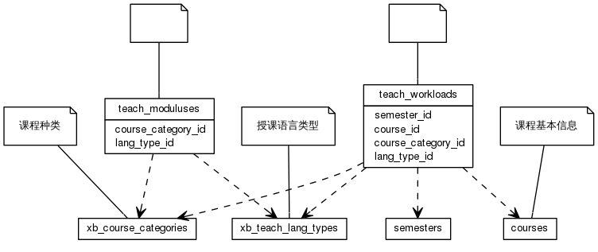


 目  录

* toc
{:toc}

### 关系图 1. 教学工作量
  * 关系图
  

### 表格 teach_moduluses

  * 表格说明

<table class="table table-bordered table-striped table-condensed">
<tr><th style="background-color:#D0D3FF">表名</th><th style="background-color:#D0D3FF">主键</th><th style="background-color:#D0D3FF">注释</th>  </tr>
<tr><td>teach_moduluses</td><td>id</td><td></td>  </tr>
</table>

  * 表格中的列

<table class="table table-bordered table-striped table-condensed">
<tr><th style="background-color:#D0D3FF">序号</th><th style="background-color:#D0D3FF">字段名</th><th style="background-color:#D0D3FF">字段类型</th><th style="background-color:#D0D3FF">是否可空</th><th style="background-color:#D0D3FF">描述</th><th style="background-color:#D0D3FF">引用表</th>  </tr>
<tr><td>1</td><td>id</td><td>int8</td><td>否</td><td></td><td></td>  </tr>
<tr><td>2</td><td>lang_type_id</td><td>int4</td><td>否</td><td></td><td>xb_teach_lang_types</td>  </tr>
<tr><td>3</td><td>course_category_id</td><td>int4</td><td>否</td><td></td><td>xb_course_categories</td>  </tr>
<tr><td>4</td><td>modulu_mark</td><td>varchar(255)</td><td>是</td><td></td><td></td>  </tr>
<tr><td>5</td><td>max_std_count</td><td>int4</td><td>否</td><td></td><td></td>  </tr>
<tr><td>6</td><td>min_std_count</td><td>int4</td><td>否</td><td></td><td></td>  </tr>
<tr><td>7</td><td>modulus_value</td><td>float4</td><td>否</td><td></td><td></td>  </tr>
</table>

 
  * 表格的索引

<table class="table table-bordered table-striped table-condensed">
  <tr>
<th style="background-color:#D0D3FF">索引名</th><th style="background-color:#D0D3FF">索引字段</th><th style="background-color:#D0D3FF">是否唯一</th>  </tr>
<tr><td>teach_moduluses_pkey</td><td>id&nbsp;</td><td>是</td>  </tr>
</table>

### 表格 teach_workloads

  * 表格说明

<table class="table table-bordered table-striped table-condensed">
<tr><th style="background-color:#D0D3FF">表名</th><th style="background-color:#D0D3FF">主键</th><th style="background-color:#D0D3FF">注释</th>  </tr>
<tr><td>teach_workloads</td><td>id</td><td></td>  </tr>
</table>

  * 表格中的列

<table class="table table-bordered table-striped table-condensed">
<tr><th style="background-color:#D0D3FF">序号</th><th style="background-color:#D0D3FF">字段名</th><th style="background-color:#D0D3FF">字段类型</th><th style="background-color:#D0D3FF">是否可空</th><th style="background-color:#D0D3FF">描述</th><th style="background-color:#D0D3FF">引用表</th>  </tr>
<tr><td>1</td><td>id</td><td>int8</td><td>否</td><td></td><td></td>  </tr>
<tr><td>2</td><td>lesson_id</td><td>int4</td><td>是</td><td></td><td></td>  </tr>
<tr><td>3</td><td>course_id</td><td>int4</td><td>是</td><td></td><td>courses</td>  </tr>
<tr><td>4</td><td>semester_id</td><td>int4</td><td>是</td><td></td><td>semesters</td>  </tr>
<tr><td>5</td><td>std_count</td><td>int4</td><td>否</td><td></td><td></td>  </tr>
<tr><td>6</td><td>lang_type_id</td><td>int4</td><td>是</td><td></td><td>xb_teach_lang_types</td>  </tr>
<tr><td>7</td><td>course_category_id</td><td>int4</td><td>是</td><td></td><td>xb_course_categories</td>  </tr>
<tr><td>8</td><td>teach_modulus_id</td><td>int8</td><td>是</td><td></td><td></td>  </tr>
<tr><td>9</td><td>totle_workload</td><td>int4</td><td>是</td><td></td><td></td>  </tr>
</table>

 
  * 表格的索引

<table class="table table-bordered table-striped table-condensed">
  <tr>
<th style="background-color:#D0D3FF">索引名</th><th style="background-color:#D0D3FF">索引字段</th><th style="background-color:#D0D3FF">是否唯一</th>  </tr>
<tr><td>teach_workloads_pkey</td><td>id&nbsp;</td><td>是</td>  </tr>
</table>
